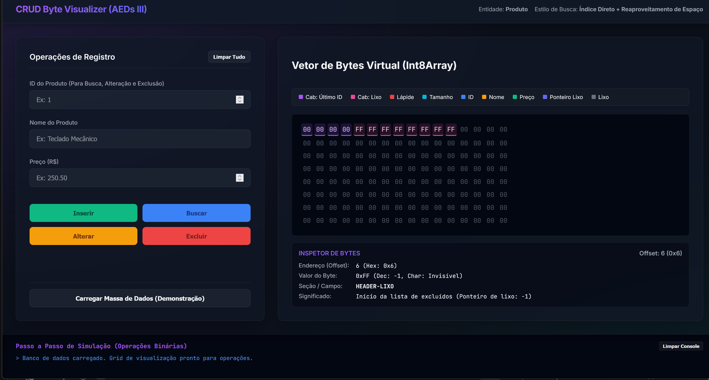
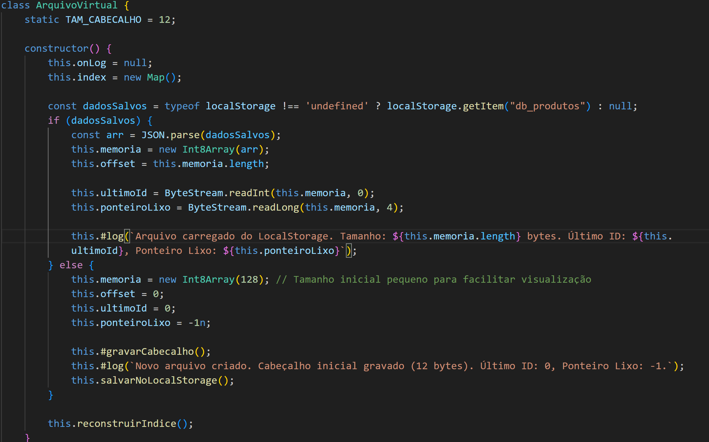
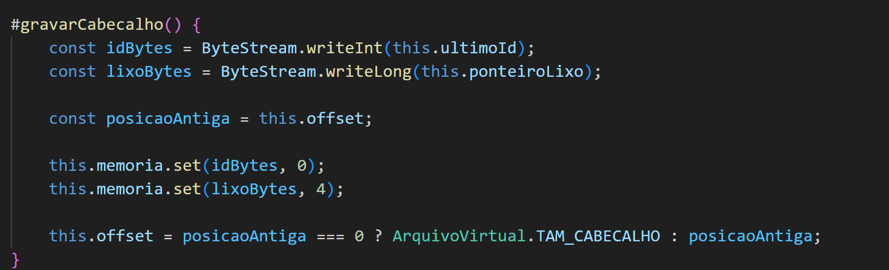
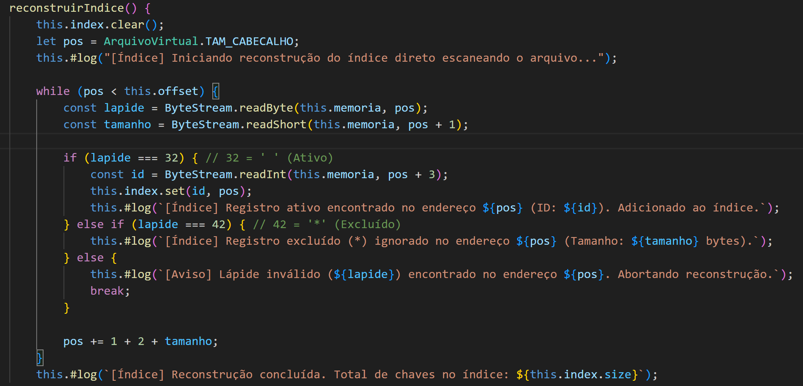
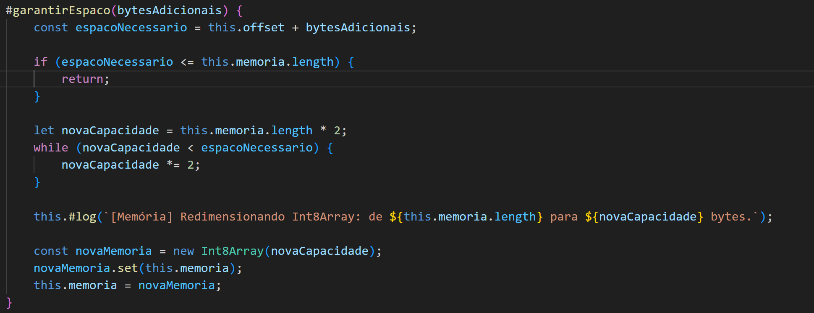
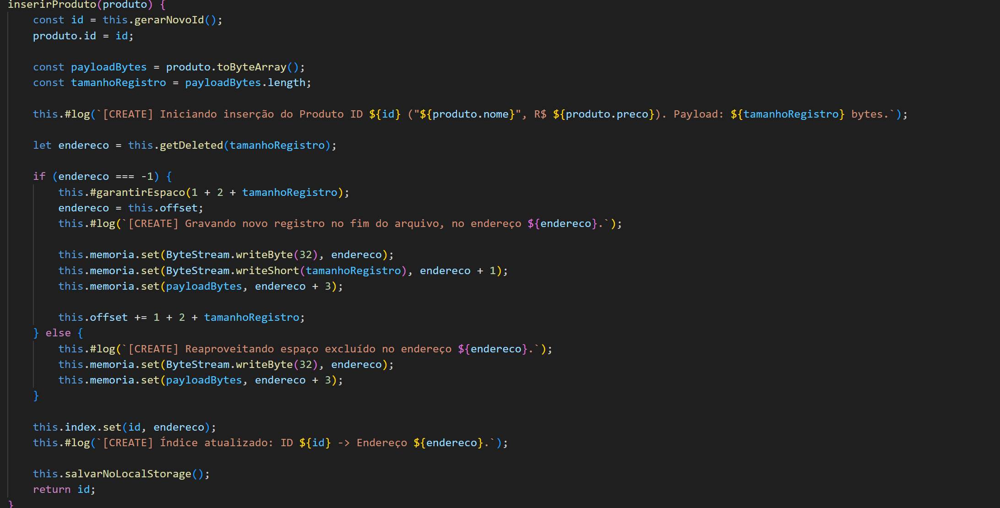
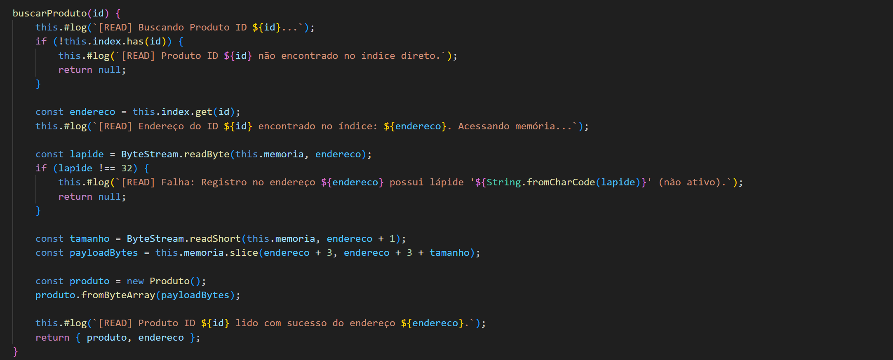
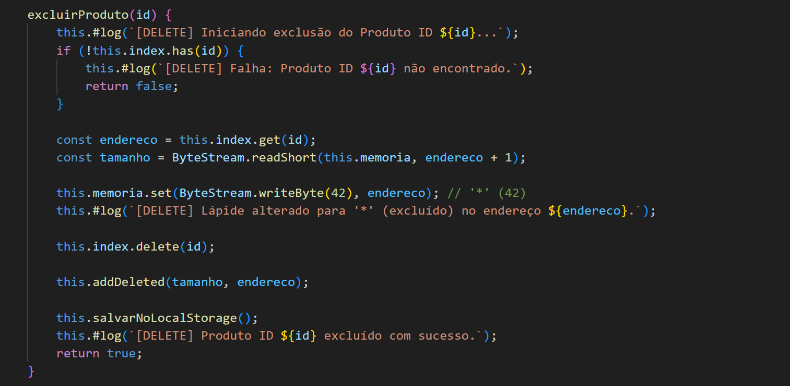
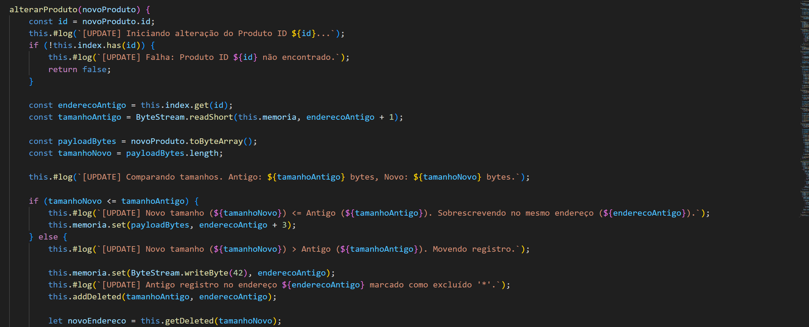
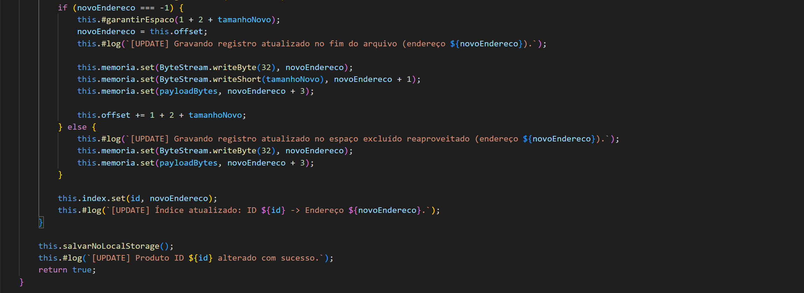

## TP4: Visualica

## Descrição Geral

Neste trabalho prático, criamos um sistema de visualizacao interativa do funcionamento de gravar dados em um arquivo.

Nosso sistema é capaz de:

- Simular a gravacao de dados em um arquivo
- Mostrar em tempo real como as operacoes CRUD afetam o arquivo.
- Deixar o usuario inspectar qualquer elemento da seuqencia de dados do arquivo para ver o elemento correspondente no objeto
- Narrar o passo a passo do que esta acontecendo em um log de console simulado.
---

## Participantes

- Gabriel Couto
- Leonardo Amaral
- Rafael Cortat

---

## Estrutura De Webpage:
### Index.html:
- A pagina de entrada, somente redireciona para main.html
### ArquivoVirtual.js
- O arquivo javascript que contem a conversao/simulacao do CRUD2 providenciado pelo professor, no javascript, funcionando atraves de guardando a informacao no formato json na memoria local do browser, composto somente de int8array.
### Produto.js
- Contem a informacao sobre a entidade, e o metodo que converte a entidade para bytes, e converte de bytes para a entidade.
### ByteStream.js
- Arquivo dado pelo professor que contem metodos para converter de tipos basicos para bytes e de volta.
### main.html 
- Pagina principal, contem todo o estilo, informacao html, e funcionalidade de JS que fazezm a pagina funcionar.
---

**Descrição Completa do Sistema**

O sistema é uma pagina web que demostra como dados sao armazenados em arquivos no formato de bytes, com a capacidade de simular operacoes CRUD, sendo capas de ver as operacoes serem executadas em tempo real, com os hexadecimais correspondendo a varias partes da entidade/do arquivo sendo coloridos unicamente para ficar claro o que e o que. Tambem tem um console simulado que mostra o passo a passo das operacoes.
## Figura 1 - Pagina Central Vazia

## Simulacao De Arquivo
Nos fazemos uma conversao do codigo de CRUD que usamos nos TPs de java para o javascript. Como RandomAcessFile nao existe no java, nos simulamos este funcionamento no array int8array de JavaScript atravez de guardar um valor "offset" representando o End of File. O equivalente do HashMapExtensivel de id->posicao e o variavel index, um Map nativo de java.
## Figura 2 - Construtor de ArquivoVirtual

A funcao de gravar cabecalho serve para atualizar o cabecalho do arquivo simulado, e e chamado toda vez que informacao que e necessario ser gravada no cabecalho e atualizada.
## Figura 3 - Funcao "gravarCabecalho"

A funcao reconstruirIndice serve para percorrer o arquivo todo quando a pagina e inicializada, e ai popular o Mapa. Ele percorre o arquivo ate o offset (representando o end of file), nao gravando entradas excluidas.
## Figura 4 - Funcao "reconstruirIndice"

Como arrays tipados no JavaScript nao sao capazes de automaticamente resizing, este metodo serve para aumentar o espaco do array central quando necessario. Ele funciona por passando o numero de bytes a ser adicionadas, que e adicionado a o EoF corrente, e comparado com o valor length do array central. Se nao for suficiente, o metodo cria um novo array com dobro a capacidade, copia todos os dados de um para o outro, e salva o novo como o array central. Este metodo e chamado durante a operacao de insercao, e quando alteracao de uma entrada e grande demais e necesita ser movida para o final.
## Figura 5 - Funcao "garantirEspaco"

Estes metodos sao as traducoes das funcionalidades CRUD do Java para funcionar no JavaScript. Mudancas notaveis sao o metodo de garantirEspaco que foi mencionado anteriormente.
## Figuras 6-10  - Funcoes CRUD
- 
- 
- 
- 
- 
## Pagina Central

## CHECKLIST?

- [x] O índice invertido com os termos dos nomes dos cursos foi criado usando a classe ListaInvertida? *SIM*
- [x] É possível buscar cursos por palavras no menu de inscrição? *SIM*
- [x] O trabalho compila corretamente? *SIM*
- [x] O trabalho está completo e funcionando sem erros de execução? *SIM*
- [x] O trabalho é original e não a cópia de um trabalho de outro grupo? *SIM*

---